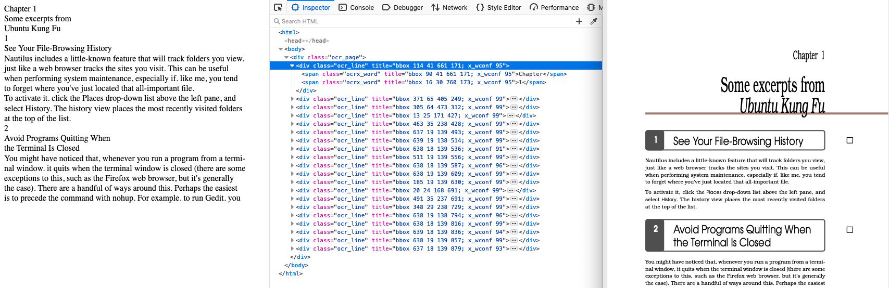

# Amazon Textract to hOCR
Convert your Amazon Textract results to hOCR output. 

### Usage Instructions

The code necessary for transforming Amazon Textract text extraction results to hOCR output is located in code/hocrOuput.py.

To make the code work you will need to install the following packages via pip:
- [Yattag](https://www.yattag.org/download-install) package (used for HTML generation)
- [Textract-Caller](https://github.com/aws-samples/amazon-textract-textractor/tree/master/caller) to make calls to Amazon Textract

Inside **code/hocrOuput.py**, in the main function, replace the *input_document_url* with your document location in Amazon S3.

Run the script, it will generate an output html file.

### Output example

## Security

See [CONTRIBUTING](CONTRIBUTING.md#security-issue-notifications) for more information.

## License

This library is licensed under the MIT-0 License. See the LICENSE file.

